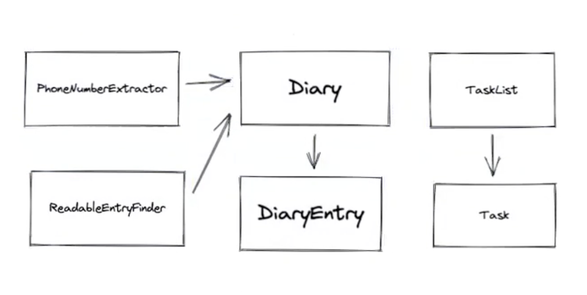

# Organiser -- Multi-Class Planned Design Recipe

## 1. Describe the Problem

*User Story*

***As a user***
***So that I can record my experiences***
***I want to keep a regular diary***

***As a user***
***So that I can reflect on my experiences***
***I want to read my past diary entries***

***As a user***
***So that I can reflect on my experiences in my busy day***
***I want to select diary entries to read based on how much time I have and my reading speed***

***As a user***
***So that I can keep track of my tasks***
***I want to keep a todo list along with my diary***
##### Add todos, Mark Complete, List Complete, Incomplete

***As a user***
***So that I can keep track of my contacts***
***I want to see a list of all of the mobile phone numbers in all my diary entries***
##### Phone Number : starts with zero, 11 digits long


Nouns : classes & attributes
###### Diary - Diary Entries - Experiences - Time - Reading Speed - Tasks - Phone Numbers - List of Phone Numbers

Verbs : methods & functionality
###### Record - Keep - Reflect - Read -Select - Keep - See a List - Mark Complete - List Complete - List Incomplete - Add


## 2. Design the Class Interface



-  initializer
- public properties
- public methods with all parameters
- return values
- side-effects (anything that does other than the intended functionality // mutates something like adding to a list)


```python

class Diary:
    def __init__(self):
        # Side-effects
        #   creates empty list to hold diary entries
        pass

    def add(self, diary_entry):
        # Parameters:
        #   diary_entry -- instance of DiaryEntry()
        # Returns:
        #   nothing
        # Side-effects
        #  adds to list of diary entries
        pass 

    def all(self):
        #Returns :
        #   list of DiaryENtry instances
        pass


class DiaryEntry:
    
    # PUBLIC PROPERTIES -- expose them
    #   title -- str - entry title
    #   contents -- str - entry contents

    def __init__(self, title, contents):
        # Parameters:
        #   title -- str - entry title
        #   contents -- str - entry contents
        # Side effects:
        #   sets properties -- title, contents
        pass


class TaskList:

    def add(self, task):
        # Parameters:
        #   task -- instance of Task()
        # Returns:
        #   nothing
        # Side-effects
        #  adds to lists of tasks
        pass 

    def all_incomplete(self):
        # Returns :
        #   list of incompleted tasks -- instances of Task()
        pass


    def all_complete(self):
        # Returns :
        #   list of completed tasks -- instances of Task()
        pass


class Task():

    # PUBLIC PROPERTIES -- expose them
    #   title -- str - job to do

    def __init__(self, title):
        # Parameters:
        #   title -- str - job to do
        # Side effects:
        #  sets title property
        pass

    def mark_complete(self): 
        # Returns
        #   nothing
        # Side-effects
        #  sets/marks tasks as complete
        pass 


class PhoneNumberExtractor:


    def __init__(self, diary):
        # Parameters:
        #   diary -- instance of Diary()
        # Side effects:
        #   set diary property
        pass

    def extract(self): 
        # Returns:
        #   list of phone numbers -- saved as strings
        pass  


class ReadableEntryExtractor:
  

    def __init__(self, diary):
        # Parameters:
        #   diary -- instance of Diary()
        # Side effects:
        #   set diary property
        pass

    def extract(self, wpm, minutes):
        # Parameters : 
        #   wpm -- int
        #   minutes -- int
        # Returns:
        #   longest diary entry than can be read in time given
        pass 


```

## 3. Create Examples as Integration Tests
_examples of classes being used together in different situations and combinations that reflect the ways in which the system will be used_


``` python

#--------------------------- DIARY + DIARY ENTRY ------------------------------
# new diary entry created -- added to Diary(Parent) -- updates list
"""
Add multiple diary entries
All lists - order they were added
"""
diary = Diary()

entry_1 = DiaryEntry("Title 1", "Contents 1")
entry_2 = DiaryEntry("Title 2", "Contents 2")
entry_3 = DiaryEntry("Title 3", "Contents 3")

diary.add(entry_1)
diary.add(entry_2)
diary.add(entry_3)

diary.all() -> [entry_1, entry_2, entry_3]


#--------------------------- TASK + TASKLIST -----------------------------
# new task created -- added to TaskList(Parent) -- updates incomplete list 
"""
Add multiple tasks
NONE MARKED AS COMPLETE
all_incomplete only lists the incomplete tasks
"""
task_list = TaskList()

task_1 = Task("Walk the dog")
task_2 = Task("Walk the cat")
task_3 = Task("Walk the frog")

task_list.add(task_1)
task_list.add(task_2)
task_list.add(task_3)

task_list.all_incomplete() -> [task_1, task_3]


"""
Add multiple tasks
MARK 1 AS COMPLETE
all_complete only lists the complete tasks
"""
task_list = TaskList()

task_1 = Task("Walk the dog")
task_2 = Task("Walk the cat")
task_3 = Task("Walk the frog")

task_list.add(task_1)
task_list.add(task_2)
task_list.add(task_3)

task_2.mark_complete()

task_list.all_complete() -> [task_2]


# ------------------------ PhoneNumberExtractor -----------------------------
"""
Add multiple diary entries
CALL EXTRACT FUNCTION -- PhoneNumberExtractor
Returns lists of phone numbers from all diary entries
"""
# initialise Parent(Diary)
diary = Diary()

# initialise & add entry to Child(DiaryEntry)
entry_1 = DiaryEntry("Title 1", "My friend is 07000000000 and 07800000000")
entry_2 = DiaryEntry("Title 2", "Contents 2")
entry_3 = DiaryEntry("Title 3", "My friend is 0770000000")

# update Parent(Diary)
diary.add(entry_1)
diary.add(entry_2)
diary.add(entry_3)

# initialise & add diary to Child(PhoneNumberExtractor)
extractor.extract() -> ["07000000000", "07800000000", "0770000000"]


"""
Add diary entry
CALL EXTRACT FUNCTION -- PhoneNumberExtractor
IGNORES DUPLICATES PHONE NUMBER 
"""
diary = Diary()

# all numbers the same, saved once
entry_1 = DiaryEntry("Title 1", "My friend is 07800000000 and 07800000000")
entry_2 = DiaryEntry("Title 2", "My friend is 07800000000")

diary.add(entry_1)
diary.add(entry_2)

extractor = PhoneNumberExtractor(diary)
extractor.extract() -> ["07800000000"]


"""
Add diary entry
CALL EXTRACT FUNCTION -- PhoneNumberExtractor
IGNORES NON-VALID PHONE NUMBER -- less/more than 11 digits
"""
diary = Diary()

entry_1 = DiaryEntry("Title 1", "My friend is 07800000000 and 0790000000 and 0780 13141")

diary.add(entry_1)

extractor = PhoneNumberExtractor(diary)

extractor.extract() -> []


"""
NO DIARY ENTRY ADDED
CALL EXTRACT FUNCTION -- PhoneNumberExtractor
RETURNS AN EMPTY LIST
"""
diary = Diary()

extractor = PhoneNumberExtractor(diary)

extractor.extract() -> []


# ------------------------ ReadableEntryExtractor ------------------------------
"""
ADD 1 DIARY ENTRY THAT MATCHES GIVEN TIME
Call ReadableEntryExtractor
wpm = 2
minutes = 2
RETURNS DIARY ENTRY THAT WAS JUST ADDED
"""
diary = Diary()

entry_1 = DiaryEntry("Title", "one two three four")

diary.add(entry_1)

extractor = ReadableEntryExtractor(diary)
extractor.extract(wpm=2, minutes=2) -> entry_1


"""
ADD 1 DIARY ENTRY THAT DOES NOT MATCH GIVEN TIME
Call ReadableEntryExtractor
RETURNS NONE
"""
diary = Diary()

entry_1 = DiaryEntry("Title", "one two three four five")

diary.add(entry_1)

extractor = ReadableEntryExtractor(diary)
extractor.extract(wpm=2, minutes=2) -> None


"""
ADD MULTIPLE DIARY ENTRIES, ONE MATCHES
Call ReadableEntryExtractor
RETUNRS ONLY 1 THAT MATCHES
"""
diary = Diary()

entry_1 = DiaryEntry("Title", "one two three four five") #does not match
entry_2 = DiaryEntry("Title", "one two three four") #matches

diary.add(entry_1)
diary.add(entry_2)

extractor = ReadableEntryExtractor(diary)
extractor.extract(wpm=2, minutes=2) -> entry_2


"""
ADD MULTIPLE DIARY ENTRIES, MULTIPLE MATCHES
Call ReadableEntryExtractor
RETUNRS ONLY LONGEST READABLE & MATCHING TIME
"""
diary = Diary()

entry_1 = DiaryEntry("Title", "one two three four five") #does not match
entry_2 = DiaryEntry("Title", "one two three four") #matches
entry_3 = DiaryEntry("Title", "one two three") #does not match

diary.add(entry_1)
diary.add(entry_2)
diary.add(entry_3)

extractor = ReadableEntryExtractor(diary)
extractor.extract(wpm=2, minutes=2) -> entry_2


"""
ADD NO DIARY ENTRIES
Call ReadableEntryExtractor
RETUNRS NONE
"""
diary = Diary()

extractor = ReadableEntryExtractor(diary)
extractor.extract(wpm=2, minutes=2) -> None


```

## 4. Create Examples as Unit Tests


``` python

#--------- Diary
"""
Initially, Diary has no entries
"""
diary = Diary()
diary.all() -> []


#---------- DiaryEntry
"""
DiaryEntry constructed with title & contents
Add diary entry
Set Title
Set Contents
"""
entry = DiaryEntry("Title", "Contents")
entry.title -> "Title"
entry.contents -> "Contents"


#---------- TaskList
"""
Initially, TaskList has no incomplete tasks
"""
task_list = TaskList()
task_list.all_incomplete() -> []

"""
Initially, TaskList has no complete tasks
"""
task_list = TaskList()
task_list.all_complete() -> []


#---------- Task
"""
Task constructed with title
"""
task = Task()
task.title -> "Walk the dog"


```


## 5. Implement the Behaviour

Write Test -- (RED) Fail Test -- Implement Behaviour -- (GREEN) Pass Test 
Write New Test -- (RED) Fail Test -- Refactor to Implement Added Behaviour -- (GREEN) Pass Test 

*repeat until program is complete*  
